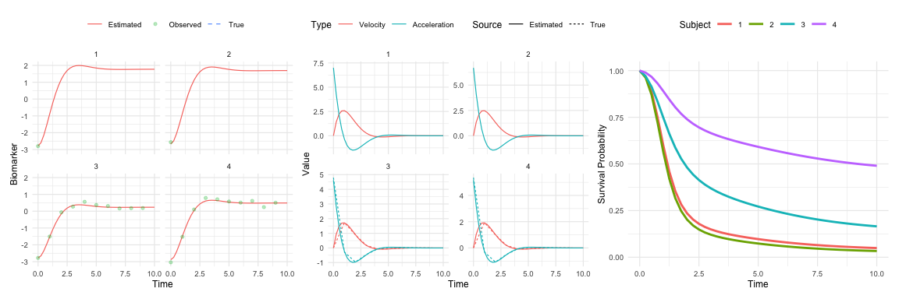

<!-- README.md is generated from README.Rmd. Please edit that file -->

# JointODE

<!-- badges: start -->

[](https://lifecycle.r-lib.org/articles/stages.html#experimental)
[](https://github.com/ziyangg98/JointODE/actions/workflows/R-CMD-check.yaml)
[](https://app.codecov.io/gh/ziyangg98/JointODE)

<!-- badges: end -->

The **JointODE** package provides a unified framework for joint modeling
of longitudinal biomarker measurements and time-to-event outcomes using
ordinary differential equations (ODEs). This approach enables the
simultaneous analysis of biomarker trajectories and their impact on
survival outcomes.

## Model Setup

The observed biomarker measurements are modeled as:

$$V_{ij}=m_i(T_{ij})+b_i+\varepsilon_{ij},\quad i=1,\ldots,n,\quad j=1,\ldots,n_i$$

where:

- $V_{ij}$: Observed biomarker value for subject $i$ at time $T_{ij}$
- $m_i(t)$: True underlying biomarker trajectory
- $b_i\sim\mathcal{N}(0,\sigma_{b}^{2})$: Subject-specific random
  intercept
- $\varepsilon_{ij}\sim\mathcal{N}(0,\sigma_{e}^{2})$: Measurement error

The biomarker trajectory evolution is characterized by the following
second-order differential equation:

$$\ddot{m}_i(t) + 2 \xi \omega_n \dot{m}_i(t) + \omega_n^2 m_i(t) = k \omega_n^2 \boldsymbol{X}_i(t)^{\top} \boldsymbol{\beta},$$

where $\dot{m}_i(t)$ and $\ddot{m}_i(t)$ denote the biomarker’s velocity
and acceleration, respectively, and $\boldsymbol{X}_i(t)$ denotes
time-varying covariates. The parameters have the usual interpretations:
$\omega_n > 0$ is the natural frequency, $\xi$ is the damping ratio, and
$k$ is the steady-state gain.

### Survival Sub-Model

The hazard function incorporates biomarker dynamics:

$$\lambda_i(t) = \lambda_{0}(t)\exp\left[\alpha_1 m_i(t) + \alpha_2 \dot{m}_i(t) + \mathbf{W}_i(t)^{\top}\boldsymbol{\phi}+b_{i}\right]$$

where:

- $\lambda_{0}(t)$: Baseline hazard (e.g., Weibull, piecewise constant)
- $\mathbf{W}_i(t)$: Time-dependent or time-independent covariates with
  effects $\boldsymbol{\phi}$

For detailed mathematical derivations including ODE formulation,
likelihood construction, and EM algorithm specifics, see the [technical
documentation](http://gongziyang.com/JointODE/articles/technical-details.html).

## Installation

You can install the development version of JointODE from
[GitHub](https://github.com/) with:

``` r
# install.packages("pak")
pak::pak("ziyangg98/JointODE")
```

## Example

Here’s a basic example demonstrating typical usage:

``` r
library(JointODE)
#> 
#> Attaching package: 'JointODE'
#> The following object is masked from 'package:stats':
#> 
#>     simulate
library(survival)

# Load example dataset
data(sim)

# Fit joint ODE model
fit <- JointODE(
  longitudinal_formula = observed ~ x1 + x2,
  survival_formula = Surv(time, status) ~ w1 + w2,
  longitudinal_data = sim$data$longitudinal_data,
  survival_data = sim$data$survival_data,
  state = as.matrix(sim$data$state),
  spline_baseline = list(
    degree = 2,
    n_knots = 1,
    knot_placement = "equal",
    boundary_knots = NULL
  ),
  parallel = TRUE
)

# Model summary
summary(fit)
#> 
#> Call:
#> JointODE(longitudinal_formula = observed ~ x1 + x2, survival_formula = Surv(time, 
#>     status) ~ w1 + w2, longitudinal_data = sim$data$longitudinal_data, 
#>     survival_data = sim$data$survival_data, state = as.matrix(sim$data$state), 
#>     spline_baseline = list(degree = 2, n_knots = 1, knot_placement = "equal", 
#>         boundary_knots = NULL), parallel = TRUE)
#> 
#> Data Descriptives:
#> Longitudinal Process            Survival Process
#> Number of Observations: 1052    Number of Events: 134 (67%)
#> Number of Subjects: 200
#> 
#>        AIC        BIC     logLik
#>  -1598.511  -1549.036    814.255
#> 
#> Coefficients:
#> Longitudinal Process: Second-Order ODE Model
#>               Estimate Std. Error z value Pr(>|z|)    
#> -omega_n^2    -1.53441    0.01770 -86.711  < 2e-16 ***
#> -2*xi*omega_n -1.71667    0.02512 -68.348  < 2e-16 ***
#> (Intercept)   -0.02772    0.00791  -3.505 0.000457 ***
#> x1             1.22683    0.01574  77.918  < 2e-16 ***
#> x2            -0.75840    0.01111 -68.233  < 2e-16 ***
#> ---
#> Signif. codes:  0 '***' 0.001 '**' 0.01 '*' 0.05 '.' 0.1 ' ' 1
#> 
#> ODE System Characteristics:
#>                    Estimate Std. Error z value Pr(>|z|)    
#> T (period)          5.07235    0.02925  173.42   <2e-16 ***
#> xi (damping ratio)  0.69292    0.01383   50.09   <2e-16 ***
#> ---
#> Signif. codes:  0 '***' 0.001 '**' 0.01 '*' 0.05 '.' 0.1 ' ' 1
#> 
#> Survival Process: Proportional Hazards Model
#>         Estimate Std. Error z value Pr(>|z|)    
#> alpha_1  0.35166    0.13249   2.654  0.00795 ** 
#> alpha_2  0.86287    0.19561   4.411 1.03e-05 ***
#> w1       0.33833    0.08632   3.919 8.88e-05 ***
#> w2      -0.49025    0.17449  -2.810  0.00496 ** 
#> ---
#> Signif. codes:  0 '***' 0.001 '**' 0.01 '*' 0.05 '.' 0.1 ' ' 1
#> 
#> Baseline Hazard: B-spline with 4 basis functions
#> (Coefficients range: [-2.981, -1.664] )
#> 
#> Variance Components:
#>               StdDev
#> Random Effect       0.088978
#> Residual            0.103563
#> 
#> Model Diagnostics:
#> C-index (Concordance): 0.845
#> Convergence: EM algorithm converged after 34 iterations

# Generate predictions
predictions <- predict(fit, times = seq(0, 10, by = 0.25))
```

## Visualization

    #> 
    #> Attaching package: 'dplyr'
    #> The following objects are masked from 'package:stats':
    #> 
    #>     filter, lag
    #> The following objects are masked from 'package:base':
    #> 
    #>     intersect, setdiff, setequal, union



## Code of Conduct

Please note that the JointODE project is released with a [Contributor
Code of Conduct](http://gongziyang.com/JointODE/CODE_OF_CONDUCT.html).
By contributing to this project, you agree to abide by its terms.
