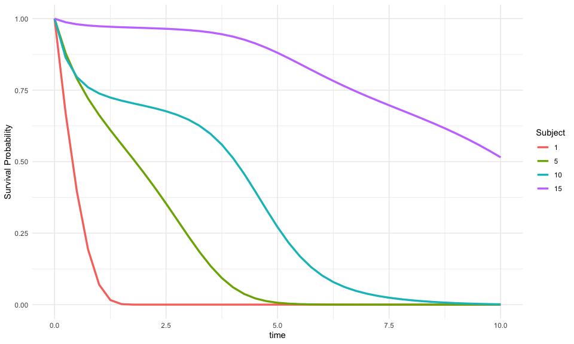

<!-- README.md is generated from README.Rmd. Please edit that file -->

# JointODE

<!-- badges: start -->

[](https://lifecycle.r-lib.org/articles/stages.html#experimental)
[](https://github.com/ziyangg98/JointODE/actions/workflows/R-CMD-check.yaml)
[](https://app.codecov.io/gh/ziyangg98/JointODE)

<!-- badges: end -->

The **JointODE** package provides a unified framework for joint modeling
of longitudinal biomarker measurements and time-to-event outcomes using
ordinary differential equations (ODEs). This approach enables the
simultaneous analysis of biomarker trajectories and their impact on
survival outcomes.

## Model Setup

### Longitudinal Model

The observed biomarker measurements are modeled as:
$$V_{ij}=m_i(T_{ij})+b_i+\varepsilon_{ij},\quad i=1,\ldots,n,\quad j=1,\ldots,n_i$$

where:

- $V_{ij}$: Observed biomarker value for subject $i$ at time $T_{ij}$
- $m_i(t)$: True underlying biomarker trajectory
- $b_i\sim\mathcal{N}(0,\sigma_{b}^{2})$: Subject-specific random
  intercept
- $\varepsilon_{ij}\sim\mathcal{N}(0,\sigma_{e}^{2})$: Measurement error

The biomarker trajectory evolution is characterized by the following
second-order differential equation:

$$\ddot{m}_i(t) = f\big(m_i(t), \dot{m}_i(t), \mathbf{X}_i(t), t\big)$$

where
$f: \mathbb{R} \times \mathbb{R} \times \mathbb{R}^p \times \mathbb{R}^+ \to \mathbb{R}$
is a smooth function modeling the biomarker acceleration as a function
of its current value $m_i(t)$, velocity $\dot{m}_i(t)$, time-varying
covariates $\mathbf{X}_i(t) \in \mathbb{R}^p$, and time $t$.

### Survival Model

The hazard function incorporates biomarker dynamics:

$$\lambda_i(t) = \lambda_{0}(t)\exp\left[\mathbf{m}_i(t)^{\top}\boldsymbol{\alpha}+\mathbf{W}_i^{\top}\boldsymbol{\phi}+b_{i}\right]$$

where:

- $\lambda_{0}(t)$: Baseline hazard (e.g., Weibull, piecewise constant)
- $\mathbf{m}_i(t)=\left(m_i(t), \dot{m}_i(t), \ddot{m}_i(t)\right)^{\top}$:
  Biomarker value and derivatives
- $\boldsymbol{\alpha}=(\alpha_0, \alpha_1, \alpha_2)^{\top}$:
  Association parameters for value, velocity, and acceleration
- $\mathbf{W}_i$: Baseline covariates with coefficients
  $\boldsymbol{\phi}$
- $b_i$: Subject-specific random intercept

For detailed mathematical derivations including ODE formulation,
likelihood construction, and EM algorithm specifics, see the [technical
documentation](http://gongziyang.com/JointODE/articles/technical-details.html).

## Installation

You can install the development version of JointODE from
[GitHub](https://github.com/) with:

``` r
# install.packages("pak")
pak::pak("ziyangg98/JointODE")
```

## Example

Here’s a basic example demonstrating typical usage:

``` r
library(JointODE)
#>
#> Attaching package: 'JointODE'
#> The following object is masked from 'package:stats':
#>
#>     simulate

# Load example dataset
data(sim)

# Fit joint ODE model
fit <- JointODE(
  longitudinal_formula = sim$formulas$longitudinal,
  longitudinal_data = sim$data$longitudinal_data,
  survival_formula = sim$formulas$survival,
  survival_data = sim$data$survival_data,
  parallel = TRUE
)

# Model summary
summary(fit)
#>
#> Call:
#> JointODE(longitudinal_formula = sim$formulas$longitudinal, longitudinal_data = sim$data$longitudinal_data,
#>     survival_formula = sim$formulas$survival, survival_data = sim$data$survival_data,
#>     parallel = TRUE)
#>
#> Variance components:
#> sigma_e sigma_b
#> 0.10101 0.09658
#>
#> Fixed effects:
#>                     Estimate Std. Error z value Pr(>|z|)
#> baseline:1         -3.177691   0.678258  -4.685 2.80e-06 ***
#> baseline:2         -2.697223   0.738452  -3.653  0.00026 ***
#> baseline:3         -2.271341   0.565821  -4.014 5.96e-05 ***
#> baseline:4         -1.936159   0.419073  -4.620 3.84e-06 ***
#> baseline:5         -1.678826   0.421595  -3.982 6.83e-05 ***
#> baseline:6         -2.380270   0.505616  -4.708 2.51e-06 ***
#> baseline:7         -0.976073   0.847994  -1.151  0.24972
#> baseline:8         -0.669168   1.153001  -0.580  0.56166
#> baseline:9         -0.692297   1.180008  -0.587  0.55741
#> hazard:alpha0       0.382982   0.149611   2.560  0.01047 *
#> hazard:alpha1       0.024502   0.670308   0.037  0.97084
#> hazard:alpha2      -0.515025   0.409202  -1.259  0.20817
#> hazard:phi1         0.351680   0.081931   4.292 1.77e-05 ***
#> hazard:phi2        -0.635422   0.081704  -7.777 7.42e-15 ***
#> longitudinal:beta1 -2.241476   0.130061 -17.234  < 2e-16 ***
#> longitudinal:beta2 -3.700008   0.246194 -15.029  < 2e-16 ***
#> longitudinal:beta3 -0.003293   0.011233  -0.293  0.76939
#> longitudinal:beta4  1.461423   0.087391  16.723  < 2e-16 ***
#> longitudinal:beta5  0.726582   0.043685  16.632  < 2e-16 ***
#> longitudinal:beta6  0.371125   0.022629  16.400  < 2e-16 ***
#> ---
#> Signif. codes:  0 '***' 0.001 '**' 0.01 '*' 0.05 '.' 0.1 ' ' 1
#>
#> ---
#> Log-likelihood: 2207.167   AIC: -4370.334   BIC: -4297.771
#> N = 200  Convergence: EM algorithm converged after 35 iterations

# Generate predictions
predictions <- predict(fit, times = seq(0, 5, by = 0.5))
```

## Visualization

``` r
library(ggplot2)
library(dplyr)
#>
#> Attaching package: 'dplyr'
#> The following objects are masked from 'package:stats':
#>
#>     filter, lag
#> The following objects are masked from 'package:base':
#>
#>     intersect, setdiff, setequal, union
library(tidyr)

# Prepare data
ids <- c(1, 5, 10, 15)
df <- lapply(ids, \(i) {
  pred <- predictions[[i]]
  obs <- filter(sim$data$longitudinal_data, id == i)
  data.frame(
    id = i, time = pred$times,
    biomarker_est = pred$biomarker, velocity_est = pred$velocity,
    acceleration_est = pred$acceleration, survival = pred$survival
  ) %>%
    left_join(select(obs, time, v,
      biomarker_true = biomarker,
      velocity_true = velocity, acceleration_true = acceleration
    ), by = "time")
}) %>% bind_rows()

# Biomarker plot
ggplot(df, aes(x = time)) +
  geom_line(aes(y = biomarker_est, color = "Estimated")) +
  geom_line(
    aes(y = biomarker_true, color = "True"), linetype = 2, na.rm = TRUE
  ) +
  geom_point(aes(y = v, color = "Observed"), alpha = 0.7, na.rm = TRUE) +
  facet_wrap(~id) +
  theme_minimal() +
  labs(y = "Biomarker", color = "")
```


``` r

# Dynamics plot
df %>%
  pivot_longer(matches("(velocity|acceleration)_(est|true)"),
    names_to = c("type", "source"), names_sep = "_"
  ) %>%
  filter(!is.na(value)) %>%
  ggplot(aes(x = time, y = value, color = type, linetype = source)) +
  geom_line() +
  facet_wrap(~id, scales = "free_y") +
  theme_minimal() +
  labs(y = "Value", color = "Type", linetype = "Source")
```


``` r

# Survival plot
ggplot(df, aes(x = time, y = survival, color = factor(id))) +
  geom_line(linewidth = 1.2) +
  theme_minimal() +
  ylim(0, 1) +
  labs(y = "Survival Probability", color = "Subject")
```



## Code of Conduct

Please note that the JointODE project is released with a [Contributor
Code of Conduct](http://gongziyang.com/JointODE/CODE_OF_CONDUCT.html).
By contributing to this project, you agree to abide by its terms.
